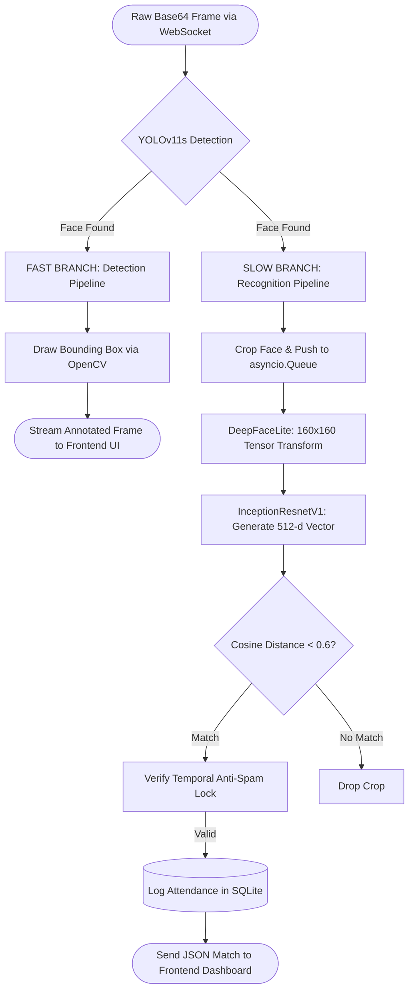
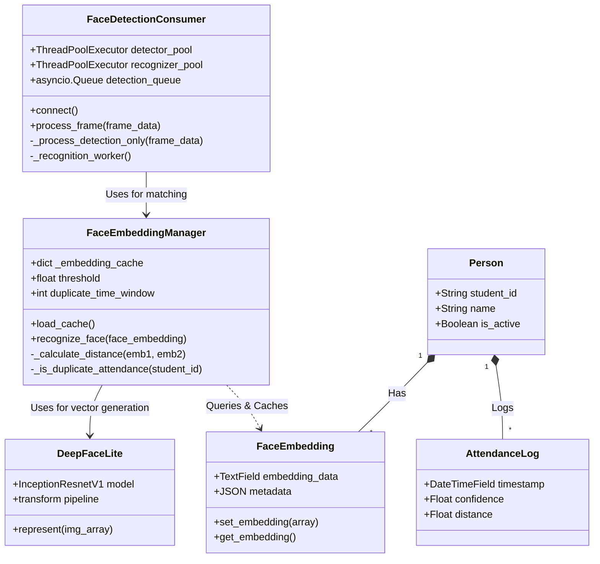

# Aiattendance 🚀

Aiattendance is a real-time facial recognition and attendance tracking platform . Built with a robust Django backend, ASGI WebSockets, and PyTorch, this system automates attendance logging without requiring any physical interaction, queues, or proprietary hardware.

---


## The Architecture: Solving the 500ms Lag Problem

Traditional web-based AI vision systems suffer from severe video lag (often **500ms+ per frame delay**) because they rely on a **synchronous pipeline**. In those systems, the server receives a frame, detects the face, runs heavy recognition math, marks the image, and then sends it back. This blocks the web server and destroys the video frame rate.

**Aiattendance fundamentally solves this using a Decoupled Asynchronous Architecture.**

We leverage **ASGI (Daphne)**, **asyncio**, and **Python ThreadPoolExecutors** to split the AI workload into two completely independent pipelines:

### 1. The Detection Pipeline (The Fast Branch)

This pipeline is responsible strictly for visual feedback and runs at high speed.

| Stage | Description |
|-------|-------------|
| **Input** | Raw Base64 frames stream in via WebSockets. |
| **Process** | The frame is passed to the **YOLOv11s** model. YOLO instantly predicts bounding box coordinates. |
| **Output** | OpenCV draws the bounding boxes on the frame and instantly streams it back to the frontend. It does **not** wait to figure out who the person is. This guarantees a buttery-smooth **30 FPS** video feed. |

### 2. The Recognition Pipeline (The "Backyard" Branch)

This pipeline handles the heavy mathematical lifting asynchronously in the background.

| Stage | Description |
|-------|-------------|
| **Input** | Bounding box coordinates from the Detection Pipeline are used to crop the faces. These crops are pushed into an `asyncio.Queue`. |
| **Process** | A background worker pops the queue and feeds the crops into our custom **DeepFaceLite** (FaceNet / InceptionResnetV1) wrapper. The image is converted into a **512-dimensional float vector**. |
| **Match** | The system calculates the **Cosine Distance** between the live vector and the pre-loaded in-memory cache of student vectors. |
| **Output** | If the distance is **< 0.6** (threshold), it's a match! The system logs the attendance in the database and sends a lightweight JSON notification to the frontend dashboard — completely independent of the video stream. |

---

## System Diagrams

### The Decoupled Pipeline Workflow

How the Fast and Slow branches operate concurrently without blocking the video stream.



### Class Diagram

The internal structure of the Python backend, showcasing consumers, managers, and database models.



---

## Core Features

- **Sub-50ms Real-Time Video** — Streams live video via WebSockets (Daphne / Channels) completely free of AI processing lag.
- **Custom AI Wrapper (DeepFaceLite)** — A custom PyTorch implementation that accepts raw NumPy arrays directly from OpenCV, bypassing slow disk I/O and temporary file generation.
- **In-Memory Vector Caching** — Preloads all student embeddings into a Python dictionary (`_embedding_cache`) upon server boot. Eliminates slow SQLite read-bottlenecks during 30 FPS video streams.
- **Privacy by Design** — Raw facial images are never stored. Faces are mathematically converted into irreversible 512-dimensional float vectors and stored securely as Base64 strings.
- **Anti-Spam Temporal Locks** — Prevents duplicate attendance logging by employing a customizable rolling window check.

---

## Installation & Setup

### Prerequisites

- Python 3.10+
- NVIDIA GPU with CUDA support *(Highly Recommended for real-time inference)*
- C++ Build Tools *(Required for compiling certain PyTorch / OpenCV dependencies)*

### 1. Clone the Repository

```bash
git clone https://github.com/kgpro/Aiattendance.git
cd Aiattendance
```

### 2. Virtual Environment & Dependencies

```bash
python -m venv venv

# Activate Virtual Environment
source venv/bin/activate        # Linux / macOS
venv\Scripts\activate        # Windows

# Install dependencies
# ⚠️ Ensure you install the correct PyTorch version for your CUDA toolkit!
pip install -r requirements.txt
```

### 3. Database Setup

```bash
python manage.py makemigrations Aiattendance
python manage.py migrate
python manage.py createsuperuser
```

### 4. Run the ASGI Server

> ⚠️ **Warning:** Do not use `python manage.py runserver`. You must use the **Daphne** ASGI server to support WebSockets.

```bash
daphne -b 0.0.0.0 -p 8000 Aiattendance.asgi:application
```

---

## REST API Endpoints

The system includes secure RESTful endpoints for populating the administrative frontend:

| Method | Endpoint | Description |
|--------|----------|-------------|
| `GET` | `/api/get_statistics` | Returns total persons, embeddings, logs, and a dynamic "Top 5" list using Django `Count` & `Q` objects. |
| `GET` | `/api/attendance_stats` | Returns the current day's total attendance and percentage rate. |
| `GET` | `/api/filtered_attendance` | Search / filter attendance logs by date, student name, or status. |

---

## Configuration & Tuning

Global AI thresholds can be adjusted directly inside `settings.py`:

```python
# settings.py
FACE_RECOGNITION_THRESHOLD = 0.6  # Cosine distance cutoff (Lower = Stricter)
YOLO_CONFIDENCE = 0.7             # Minimum confidence for a valid face detection
```

---

## License

Distributed under the **MIT License**. See [`LICENSE`](LICENSE) for more information.
